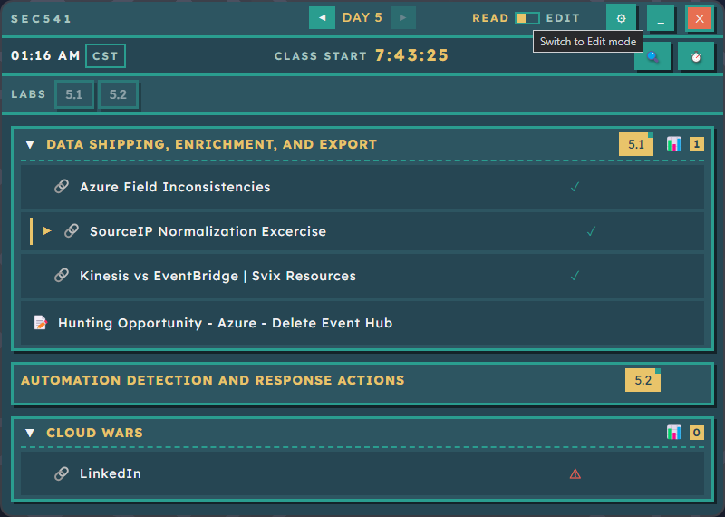
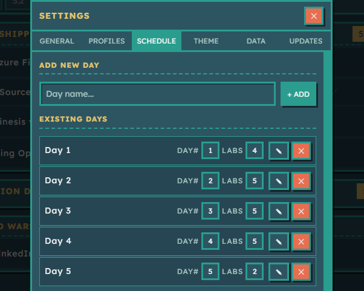
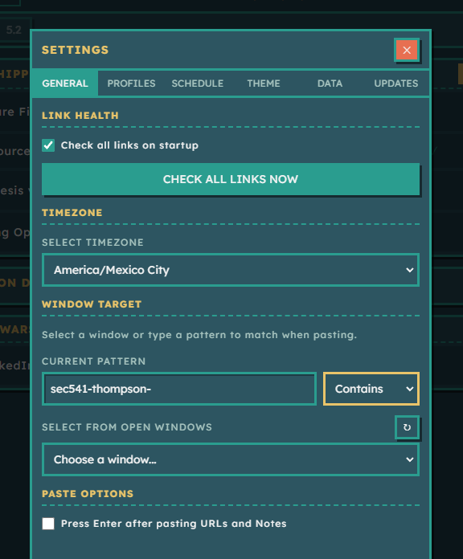
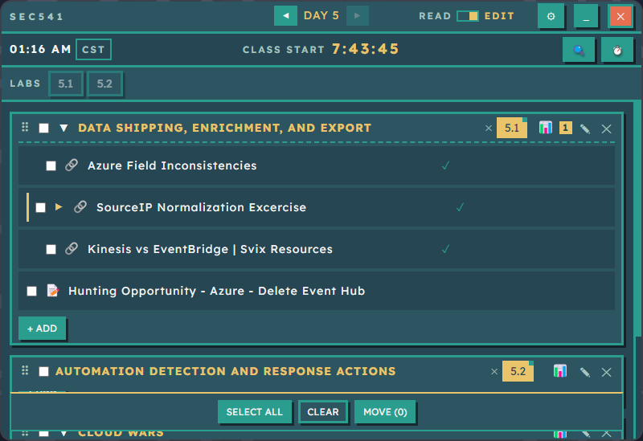
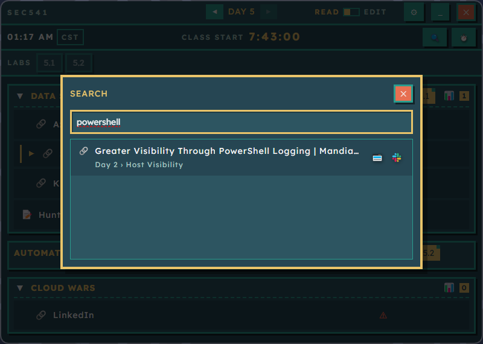
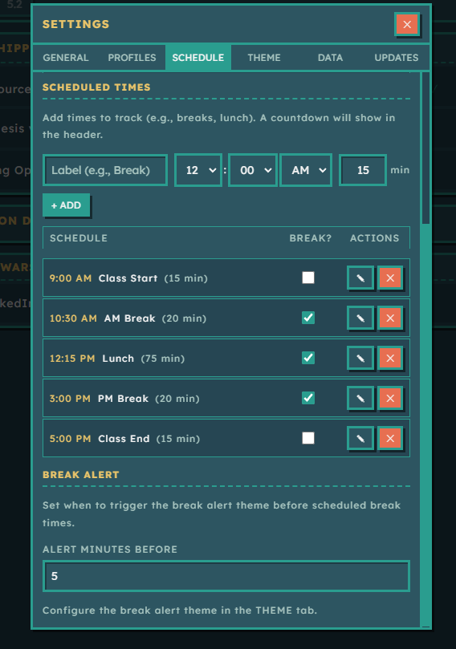
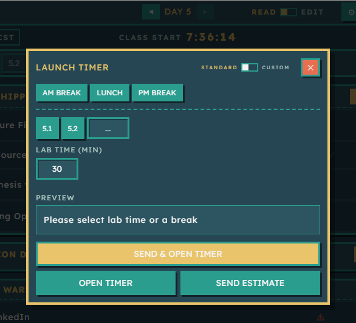
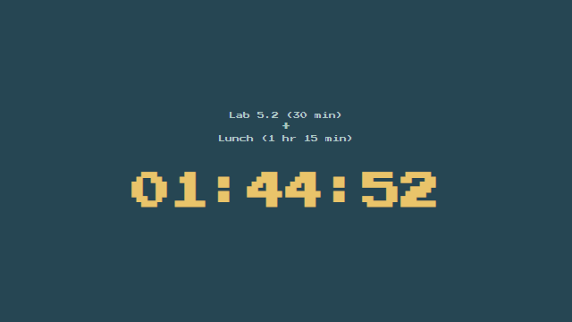
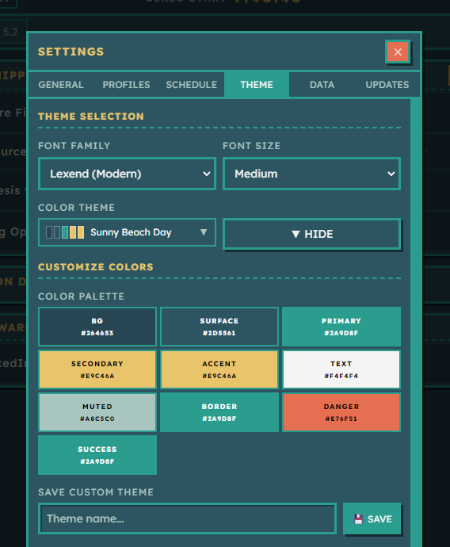

# TeachersPet

A Windows desktop application for instructors to organize and share course materials during multi-day training sessions. Built with Electron, React, and TypeScript, featuring a retro 8-bit themed UI.



## Features

### 📚 Content Organization
- **Multi-day course management** - Organize content across Days and Sections
- **Links with health checking** - Automatic URL validation with status indicators
- **Notes** - Store credentials, instructions, and reminders
- **Polls** - Quick-copy Slack-formatted polls for student check-ins
- **Lab tracking** - Assign lab numbers to sections with automatic counting

### 🎯 Quick Sharing
- **Window automation** - One-click paste URLs into target applications (Zoom, Teams, etc.)
- **Pattern matching** - Find windows by exact match, contains, or regex
- **Bulk operations** - Multi-select and move/delete items in Edit mode

### 🔍 Search & Navigation
- **Global search (Ctrl+K)** - Find content across all days and sections
- **Collapsible sections** - Focus on what you need
- **Day navigation** - Quick switching between course days

### ⏱️ Time Management
- **Scheduled times** - Track class start, breaks, lunch, and end times
- **Break alerts** - Automatic theme change before scheduled breaks
- **Countdown timer** - Standalone timer window for labs and breaks
- **Lab time presets** - Quick timer launch with lab-specific durations

### 🎨 Customization
- **Theme editor** - Customize every color with 10+ preset themes
- **Font options** - Choose between retro 8-bit and modern fonts
- **Custom timer fonts** - Separate font selection for countdown timer
- **Multi-profile support** - Manage multiple courses with independent settings

### 💾 Data Management
- **Auto-save** - Configuration persists automatically
- **Import/Export** - Backup and restore course configurations
- **Migration support** - Automatic schema updates

---

## Quick Start

### Installation

1. Download the latest installer from [Releases](https://github.com/YOUR_USERNAME/teacherspet/releases)
2. Run the installer
3. Launch TeachersPet

### First Steps

1. **Create your course structure**
   - Open Settings (gear icon) → General tab
   - Add days for your course

   

2. **Add content to sections**
   - Click **+ ADD** in any section
   - Add links (URLs auto-fetch titles), notes, or polls

3. **Configure window targeting**
   - Settings → General → Window Target
   - Set pattern for your chat application (e.g., "Zoom", "Teams")

   

---

## Core Features Guide

### Content Management

**Links** 🔗
- Paste any URL and the title auto-fetches
- Status indicators: ✓ (working), ⚠ (broken), 🔄 (checking)
- Add multiple related URLs to a single link item
- Custom titles override auto-fetched titles
- One-click copy or paste to target window

**Notes** 📄
- Multi-line text content
- Perfect for credentials, instructions, reminders
- Quick copy to clipboard

**Polls** 📊
- Slack-formatted poll templates
- Use `<LAB_NUMBER>` placeholder for dynamic lab polls
- Track sent status

### Edit Mode

Toggle Edit mode for bulk operations:



- Multi-select items with checkboxes
- Move items between sections
- Delete multiple items at once
- Reorder sections by dragging

### Link Health Checking

Keep course materials current:
- Enable "Check all links on startup" in Settings → General
- Manual check with "Check All Links Now" button
- 500ms delay between checks to avoid rate limiting
- Results stream in real-time

### Search

Press **Ctrl+K** to search across all content:



- Searches links, notes, and polls
- Shows day and section location
- Quick access buttons for each result

### Scheduled Times

Track your class schedule with automatic countdowns:



**Settings → Schedule tab:**
- Add class start, breaks, lunch, and end times
- Mark breaks to enable break alerts
- Countdown displays in header
- Configure break alert theme in Theme tab
- Set alert timing (default: 5 minutes before)

### Countdown Timer

Launch a standalone timer for labs and breaks:



**Features:**
- Preset break durations (AM Break, Lunch, PM Break)
- Lab-based timing using assigned lab numbers
- Custom duration input
- "Send & Open Timer" - Pastes estimate and launches countdown
- Customizable font (Settings → General → Timer Font)



### Theme Customization

Create your own look or choose from presets:



**Settings → Theme tab:**
- 10+ color palette controls
- Preset themes:
  - 8-Bit Classic (retro green terminal)
  - Sunset Vibes (warm oranges and purples)
  - Earthy Green (natural tones)
  - Sunny Beach Day (teal and gold)
  - Dark Sunset (dramatic reds and golds)
- Font family selection (8-bit or modern)
- Font size options (small, medium, large)
- Break alert theme (auto-switches before breaks)

### Multi-Profile Support

Manage multiple courses independently:

**Settings → Profiles tab:**
- Create profiles for different courses
- Each profile has separate:
  - Days and content
  - Theme settings
  - Window target pattern
  - Scheduled times
- Switch profiles from sidebar

---

## Development

### Prerequisites

- Node.js 18+
- npm 9+

### Setup

```bash
# Clone the repository
git clone https://github.com/YOUR_USERNAME/teacherspet.git
cd teacherspet

# Install dependencies
npm install

# Run in development mode
npm run dev

# Build for production
npm run build

# Package for Windows
npm run package
```

### Project Structure

```
src/
├── main/          # Electron main process
│   └── main.ts    # IPC handlers, file I/O, window automation
├── preload/       # IPC bridge (context isolated)
│   └── preload.ts
└── renderer/      # React frontend
    ├── components/
    │   ├── Layout/
    │   ├── Day/
    │   ├── Section/
    │   ├── Link/
    │   ├── Note/
    │   ├── Poll/
    │   ├── Settings/
    │   └── common/
    └── stores/
        └── appStore.ts  # Zustand state management (~1500 lines)
```

### Architecture

- **Process Model**: Electron main process handles all system interaction; renderer is fully sandboxed
- **State Management**: Single Zustand store with all application state
- **Storage**: `data/config.json` with automatic persistence
- **Windows Automation**: PowerShell scripts for window enumeration and focus/paste
- **Link Checking**: Uses Electron's `net` module with HEAD then GET fallback (10s timeout)

---

## Configuration

### Data Location

Configuration stored at: `data/config.json`

### Data Model

```
AppConfig
└── Profile[] (id, name, settings, days)
    └── Day[] (id, name, order, sections)
        └── Section[] (id, name, order, isCollapsed, items, polls)
            ├── Link (type: 'link', url, title, status, additionalUrls)
            └── Note (type: 'note', title, content)
```

### Settings

**General:**
- Window target (pattern, match mode, paste options)
- Link health checking
- Timezone
- Lab poll template
- Timer font family

**Schedule:**
- Scheduled times (class start, breaks, end)
- Break alert timing

**Theme:**
- Color palette (10 colors)
- Font family and size
- Break alert theme

---

## Keyboard Shortcuts

- **Ctrl+K** - Open search
- **Ctrl+S** - Open settings
- **Read/Edit toggle** - Switch between modes

---

## Common Workflows

### Before Class
1. Check all links (Settings → General → Check All Links Now)
2. Review scheduled times in header
3. Navigate to Day 1 in Read mode

### During Class
1. Navigate between days using sidebar
2. Click paste icon (📋➜) to send links to Zoom/Teams
3. Copy polls for student check-ins
4. Launch timer for labs or breaks
5. Add notes for unexpected information

### After Class
1. Mark polls as sent
2. Update any broken links
3. Add instructor notes for next session
4. Export configuration for backup

---

## Tips & Tricks

### Lab Management
- Assign lab numbers to sections (shows as badge)
- Lab poll template uses `<LAB_NUMBER>` placeholder
- Timer launcher auto-populates lab times
- Track lab count per day automatically

### Link Organization
- Use custom titles for clarity
- Add additional URLs for related resources
- Collapse completed sections
- Mark important links with custom titles

### Window Targeting
- **Contains mode**: Flexible matching (e.g., "Zoom" matches "Zoom Meeting")
- **Regex mode**: Advanced patterns (e.g., "sec541-.*student")
- Test patterns with "Select from open windows"
- Enable "Press Enter after paste" for auto-submit

### Break Alerts
- Configure break alert theme in Theme tab
- Set alert timing (default: 5 minutes)
- Mark scheduled times as "Break?" to enable
- Theme auto-reverts after break period

---

## Troubleshooting

### Links not pasting to window
1. Check window target pattern in Settings → General
2. Verify target window is open and visible
3. Try "Contains" match mode for flexibility
4. Use "Select from open windows" to test

### Links showing as broken incorrectly
1. Some sites block HEAD requests - app automatically retries with GET
2. Check site in browser to verify accessibility
3. Some sites may require authentication
4. Timeout is 10 seconds - slow sites may fail

### Timer not launching
1. Check timer font is installed
2. Close any existing timer windows
3. Verify lab numbers are assigned correctly

### Configuration not saving
1. Check write permissions for `data/config.json`
2. Export configuration as backup
3. Restart application

---

## Contributing

Contributions welcome! Please:
1. Fork the repository
2. Create a feature branch
3. Make your changes
4. Submit a pull request

---

## License

[Add your license here]

---

## Acknowledgments

Built with:
- [Electron](https://www.electronjs.org/)
- [React](https://react.dev/)
- [TypeScript](https://www.typescriptlang.org/)
- [Zustand](https://github.com/pmndrs/zustand)
- [Vite](https://vitejs.dev/)
- [electron-builder](https://www.electron.build/)

---

## Support

For issues, feature requests, or questions:
- GitHub Issues: [https://github.com/YOUR_USERNAME/teacherspet/issues](https://github.com/YOUR_USERNAME/teacherspet/issues)

---

Made with ❤️ for educators
